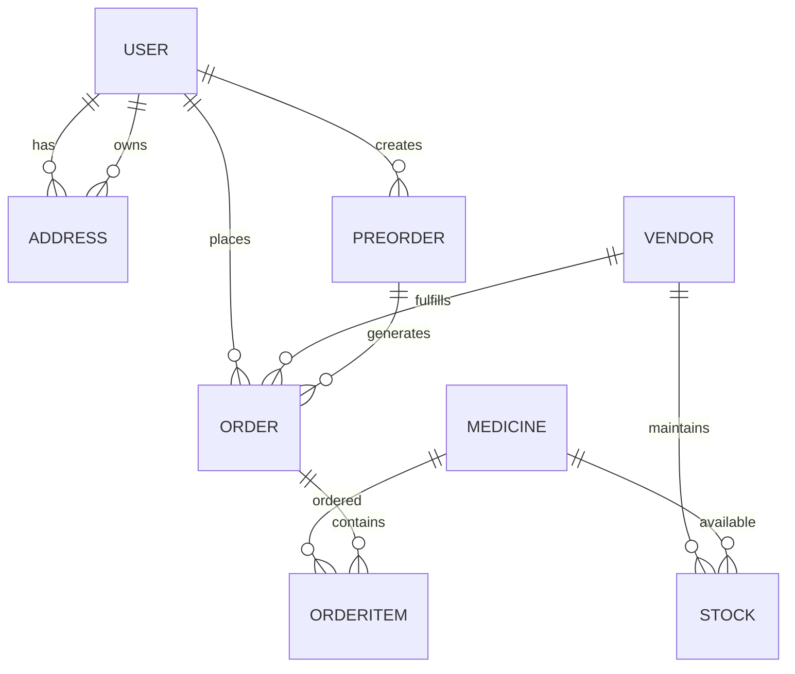

# Trego Backend API

Trego is a comprehensive medicine delivery platform backend built with Spring Boot. This system provides RESTful APIs for managing medicines, users, orders, vendors, and inventory for an online pharmacy service.

## Table of Contents
- [Overview](#overview)
- [Technology Stack](#technology-stack)
- [Project Structure](#project-structure)
- [Core Features](#core-features)
- [API Endpoints](#api-endpoints)
  - [Authentication](#authentication)
  - [User Management](#user-management)
  - [Medicine Management](#medicine-management)
  - [Order Management](#order-management)
  - [Vendor Management](#vendor-management)
  - [Inventory Management](#inventory-management)
  - [Address Management](#address-management)
- [Data Models](#data-models)
  - [Entity Relationship Diagram](#entity-relationship-diagram)
  - [Core Entities](#core-entities)
    - [User Entity](#user-entity)
    - [Medicine Entity](#medicine-entity)
    - [Vendor Entity](#vendor-entity)
    - [Stock Entity](#stock-entity)
    - [Order Entity](#order-entity)
    - [OrderItem Entity](#orderitem-entity)
    - [PreOrder Entity](#preorder-entity)
- [Business Logic](#business-logic)
  - [Order Processing Flow](#order-processing-flow)
  - [Payment Integration](#payment-integration)
  - [Inventory Management](#inventory-management-1)
  - [User Management](#user-management-1)
- [Service Layer Implementation](#service-layer-implementation)
  - [Order Service](#order-service)
  - [Medicine Service](#medicine-service)
  - [User Service](#user-service)
  - [Vendor Service](#vendor-service)
- [Repository Layer](#repository-layer)
  - [Custom Queries](#custom-queries)
  - [Relationship Management](#relationship-management)
- [DTO Layer](#dto-layer)
  - [Request DTOs](#request-dtos)
  - [Response DTOs](#response-dtos)
- [API Controllers](#api-controllers)
  - [RESTful Design](#restful-design)
  - [Error Handling](#error-handling)
- [Security Considerations](#security-considerations)
- [Setup and Installation](#setup-and-installuration)
- [Configuration](#configuration)
  - [Database Configuration](#database-configuration)
  - [Connection Pool Settings](#connection-pool-settings)
  - [Logging Configuration](#logging-configuration)
  - [API Documentation](#api-documentation-1)
- [Database Schema](#database-schema)
  - [Table Relationships](#table-relationships)
  - [Indexing Strategy](#indexing-strategy)
- [Testing](#testing)
  - [Unit Testing](#unit-testing)
  - [Integration Testing](#integration-testing)
- [API Documentation](#api-documentation-2)
- [Deployment](#deployment)
  - [Standalone JAR](#standalone-jar)
  - [Docker Deployment](#docker-deployment)
  - [Google Cloud Deployment](#google-cloud-deployment)
- [Performance Considerations](#performance-considerations)
- [Scalability](#scalability)

## Overview

Trego is a medicine delivery platform that enables users to:
- Browse and search for medicines with detailed information
- View medicine availability across different vendors
- Place orders for medicines with multiple vendors in a single transaction
- Manage user profiles and delivery addresses
- Track order status and history
- Handle pre-orders for out-of-stock items
- Process payments through Razorpay integration

The system follows a microservices-inspired architecture with clearly separated layers:
- **Controller Layer**: REST API endpoints that handle HTTP requests and responses
- **Service Layer**: Business logic implementation with transaction management
- **Repository Layer**: Data access objects using Spring Data JPA
- **Entity Layer**: Database entities mapped with JPA annotations
- **DTO Layer**: Data transfer objects for API communication and data transformation

## Technology Stack

- **Java 17**: Primary programming language with modern features like lambda expressions, streams API, and improved type inference
- **Spring Boot 3.1.2**: Framework for building the REST API with auto-configuration and embedded server support
- **Spring Data JPA**: For database operations with Hibernate as the ORM implementation
- **Spring Web MVC**: For RESTful web services with annotation-based controller mapping
- **Spring Transaction Management**: For declarative transaction management using `@Transactional` annotations
- **Hibernate 6.x**: ORM framework for object-relational mapping with lazy loading and caching
- **MySQL 8.0+**: Primary database with support for JSON data types and advanced indexing
- **Google Cloud SQL MySQL Socket Factory**: For secure connection to Google Cloud SQL instances
- **Maven 3.8+**: Build automation tool with dependency management
- **Swagger/OpenAPI (SpringDoc 2.2.0)**: API documentation with interactive testing interface
- **Lombok**: Boilerplate code reduction with annotations like `@Data`, `@Getter`, `@Setter`
- **Gson 2.8.8 & Jackson 2.13.3**: JSON processing libraries for serialization/deserialization
- **Apache Commons Lang 3**: Utility library for string manipulation and other common operations
- **JUnit 5**: Testing framework with parameterized tests and assertions
- **Razorpay API**: Payment processing integration with order creation and verification

## Project Structure

```
src/main/java/com/trego/
├── TregoApiApplication.java      # Main application entry point with @SpringBootApplication
├── api/                          # REST controllers with @RestController annotations
│   ├── AddressController.java    # Address management endpoints
│   ├── MainController.java       # Main application endpoints
│   ├── MasterController.java     # Master data endpoints (banners, categories)
│   ├── MedicineController.java   # Medicine search and retrieval endpoints
│   ├── OrderController.java      # Order placement and management endpoints
│   ├── PreOrderController.java   # Pre-order management endpoints
│   ├── StockController.java      # Inventory management endpoints
│   ├── UserController.java       # User management endpoints
│   └── VendorController.java     # Vendor management endpoints
├── dao/                          # Data access layer
│   ├── entity/                   # JPA entities with relationships
│   │   ├── Address.java          # User address entity with geolocation
│   │   ├── Banner.java           # Marketing banner entity
│   │   ├── Category.java         # Medicine category entity
│   │   ├── Medicine.java         # Medicine entity with comprehensive details
│   │   ├── Order.java            # Order entity with status tracking
│   │   ├── OrderItem.java        # Order item entity for individual medicines
│   │   ├── PreOrder.java         # Pre-order entity for complex transactions
│   │   ├── Stock.java            # Inventory entity with pricing
│   │   ├── User.java             # User entity with profile information
│   │   └── Vendor.java           # Vendor entity with business details
│   └── impl/                     # Repository implementations extending JpaRepository
│       ├── AddressRepository.java
│       ├── BannerRepository.java
│       ├── CategoryRepository.java
│       ├── MedicineRepository.java
│       ├── OrderItemRepository.java
│       ├── OrderRepository.java
│       ├── PreOrderRepository.java
│       ├── StockRepository.java
│       ├── UserRepository.java
│       └── VendorRepository.java
├── dto/                          # Data transfer objects for API communication
│   ├── response/                 # Response DTOs with @JsonInclude annotations
│   │   ├── CancelOrderResponseDTO.java
│   │   ├── CartResponseDTO.java
│   │   ├── OrderDTO.java
│   │   ├── OrderItemDTO.java
│   │   ├── OrderResponseDTO.java
│   │   ├── OrderValidateResponseDTO.java
│   │   ├── PreOrderResponseDTO.java
│   │   └── VandorCartResponseDTO.java
│   ├── AddressDTO.java
│   ├── CancelOrderRequestDTO.java
│   ├── CartDTO.java
│   ├── CategoryDTO.java
│   ├── MainDTO.java
│   ├── MedicineDTO.java
│   ├── MedicinePreOrderDTO.java
│   ├── MedicineWithStockAndVendorDTO.java
│   ├── OrderRequestDTO.java
│   ├── OrderValidateRequestDTO.java
│   ├── PreOrderDTO.java
│   ├── StockDTO.java
│   ├── SubstituteDTO.java
│   ├── UserDTO.java
│   └── VendorDTO.java
├── enums/                        # Enumerations for type safety
│   └── AddressType.java          # Address type enumeration
├── exception/                    # Custom exceptions
│   └── InvalidAmountException.java
├── service/                      # Business logic layer with interfaces and implementations
│   ├── impl/                     # Service implementations with @Service annotation
│   │   ├── AddressServiceImpl.java
│   │   ├── MainServiceImpl.java
│   │   ├── MasterServiceImpl.java
│   │   ├── MedicineServiceImpl.java
│   │   ├── OrderServiceImpl.java
│   │   ├── PreOrderServiceImpl.java
│   │   ├── StockServiceImpl.java
│   │   ├── UserServiceImpl.java
│   │   └── VendorServiceImpl.java
│   ├── IAddressService.java      # Service interfaces with method declarations
│   ├── IMainService.java
│   ├── IMasterService.java
│   ├── IMedicineService.java
│   ├── IOrderService.java
│   ├── IPreOrderService.java
│   ├── IStockService.java
│   ├── IUserService.java
│   └── IVendorService.java
└── utils/                        # Utility classes and constants
    └── Constants.java            # Application-wide constants
```

## Core Features

1. **Medicine Catalog Management**
   - Detailed medicine information including composition, usage, side effects, and interactions
   - Multiple images per medicine for better visualization
   - Advanced search and filtering capabilities with pagination
   - Medicine substitution suggestions

2. **Multi-Vendor Support**
   - Different vendors can stock the same medicine with different pricing
   - Price comparison across vendors with discount information
   - Vendor categorization (retail/online) with different business models
   - Geolocation-based vendor discovery

3. **Advanced Order Processing**
   - Multi-vendor orders in a single transaction through pre-order mechanism
   - Pre-order functionality for out-of-stock items with future availability
   - Comprehensive order status tracking from placement to delivery
   - Flexible order cancellation with reason tracking

4. **Inventory Management**
   - Real-time stock updates with quantity tracking
   - Expiry date management for medicines
   - Discount management per vendor with percentage-based calculations
   - Vendor-specific inventory with independent pricing

5. **User Management**
   - User profiles with authentication and role-based access
   - Multiple address management per user with geolocation
   - Order history tracking with detailed information
   - Contact information management with mobile number verification

6. **Payment Integration**
   - Razorpay payment gateway integration for secure transactions
   - Two-step payment verification process
   - Payment status tracking with order association
   - Test environment configuration for development

7. **Marketing Features**
   - Banner management for promotional campaigns
   - Category-based medicine organization
   - Substitute medicine suggestions for better customer experience

## API Endpoints

### Authentication
The API does not implement JWT or OAuth authentication. Authentication is handled through user ID references in requests. User creation is idempotent - if a user with the same email exists, the existing user details are returned.

### User Management
- `POST /users` - Create a new user or return existing user if email already exists
- `GET /users/{id}` - Get user by ID with associated addresses
- `PUT /users/{id}` - Update user information
- `DELETE /users/{id}` - Delete a user

### Address Management
- `POST /addresses` - Create a new address for a user
- `GET /addresses/user/{userId}` - Get all addresses for a user
- `PUT /addresses/{id}` - Update an address
- `DELETE /addresses/{id}` - Delete an address

### Medicine Management
- `GET /medicines` - Retrieve all medicines with stock and vendor information
- `GET /medicines/{id}` - Get a specific medicine by ID with detailed information
- `GET /medicines/search` - Search medicines by text with pagination and vendor filtering

### Order Management
- `POST /orders` - Place a new order (creates Razorpay order and pre-order)
- `POST /orders/validateOrder` - Validate and confirm order payment with Razorpay verification
- `GET /orders/user/{userId}` - Fetch all orders for a user with pagination
- `POST /orders/cancel` - Cancel orders with reason tracking

### Vendor Management
- `GET /vendors` - Retrieve all vendors by type (retail/online)
- `GET /vendors/{id}` - Get vendor details with medicine inventory and search capability

### Inventory Management
- `GET /stocks` - Retrieve stock information (limited implementation)

### Master Data
- `GET /masters/banners` - Retrieve banner information for homepage
- `GET /masters/categories` - Retrieve medicine categories for navigation

## Data Models

### Entity Relationship Diagram



### Core Entities

#### User Entity
The User entity represents a customer of the platform with authentication and profile information.

**Fields:**
- `id`: Unique identifier (Long, auto-generated)
- `name`: User's full name (String)
- `email`: Email address (String, unique identifier in business logic)
- `emailVerifiedAt`: Email verification timestamp (LocalDateTime)
- `password`: Encrypted password (String)
- `passwordHint`: Password hint for recovery (String)
- `rememberToken`: Token for "remember me" functionality (String)
- `mobile`: Mobile number (long)
- `role`: User role (String)
- `createdAt`: Account creation timestamp (LocalDateTime)
- `updatedAt`: Last update timestamp (LocalDateTime)

**Relationships:**
- One-to-many relationship with [Address](file:///c%3A/Users/ASUS/Downloads/trego_backend/trego_backend/src/main/java/com/trego/dao/entity/Address.java#L17-L49) entities (cascade all operations, lazy fetch)
- Mapped by the `user` field in the Address entity

**Annotations:**
- `@Data`: Lombok annotation for boilerplate code generation
- `@Entity(name = "users")`: JPA entity mapped to "users" table

#### Medicine Entity
The Medicine entity contains comprehensive information about medicines including medical details, usage instructions, and safety information.

**Fields:**
- `id`: Unique identifier (long, auto-generated)
- `name`: Medicine name (String)
- `manufacturer`: Manufacturing company (String)
- `saltComposition`: Active ingredients (String)
- `medicineType`: Type of medicine (tablet, syrup, etc.) (String)
- `introduction`: Brief description (String)
- `description`: Detailed description (String)
- `howItWorks`: Mechanism of action (String)
- `safetyAdvise`: Safety information (String)
- `ifMiss`: Instructions if dose is missed (String)
- `packing`: Packaging information (String)
- `packagingType`: Type of packaging (String)
- `prescriptionRequired`: Whether prescription is required (String)
- `storage`: Storage instructions (String)
- `useOf`: Usage instructions (String)
- `commonSideEffect`: Common side effects (String)
- `alcoholInteraction`: Alcohol interaction warnings (String)
- `pregnancyInteraction`: Pregnancy interaction warnings (String)
- `lactationInteraction`: Lactation interaction warnings (String)
- `drivingInteraction`: Driving interaction warnings (String)
- `kidneyInteraction`: Kidney interaction warnings (String)
- `liverInteraction`: Liver interaction warnings (String)
- `manufacturerAddress`: Manufacturer address (String)
- `countryOfOrigin`: Country of origin (String)
- `questionAnswers`: FAQ section (String)
- `photo1` to `photo4`: Medicine image URLs (String)

**Relationships:**
- One-to-many relationship with [Stock](file:///c%3A/Users/ASUS/Downloads/trego_backend/trego_backend/src/main/java/com/trego/dao/entity/Stock.java#L13-L32) entities (mapped by the `medicine` field)

**Annotations:**
- `@Data`: Lombok annotation for boilerplate code generation
- `@Entity(name = "medicines")`: JPA entity mapped to "medicines" table

#### Vendor Entity
The Vendor entity represents a pharmacy or seller with business information.

**Fields:**
- `id`: Unique identifier (Long, auto-generated)
- `name`: Vendor name (String)
- `druglicense`: Drug license number (String)
- `gistin`: GSTIN number (String)
- `category`: Vendor category (retail/online) (String)
- `logo`: Logo URL (String)
- `lat`: Latitude for geolocation (String)
- `lng`: Longitude for geolocation (String)
- `address`: Physical address (String)

**Annotations:**
- `@Data`: Lombok annotation for boilerplate code generation
- `@Entity(name = "vendors")`: JPA entity mapped to "vendors" table

#### Stock Entity
The Stock entity represents inventory information for medicines at vendors.

**Fields:**
- `id`: Unique identifier (long, auto-generated)
- `mrp`: Maximum retail price (double)
- `discount`: Discount percentage (double)
- `qty`: Available quantity (int)
- `expiryDate`: Expiry date (String)

**Relationships:**
- Many-to-one relationship with [Medicine](file:///c%3A/Users/ASUS/Downloads/trego_backend/trego_backend/src/main/java/com/trego/dao/entity/Medicine.java#L14-L52) entity (with `@JoinColumn`)
- Many-to-one relationship with [Vendor](file:///c%3A/Users/ASUS/Downloads/trego_backend/trego_backend/src/main/java/com/trego/dao/entity/Vendor.java#L12-L26) entity (with `@JoinColumn`)
- `@JsonIgnore` annotation on medicine relationship to prevent circular references

**Annotations:**
- `@Data`: Lombok annotation for boilerplate code generation
- `@Entity(name = "stocks")`: JPA entity mapped to "stocks" table

#### Order Entity
The Order entity represents a customer order with comprehensive tracking information.

**Fields:**
- `id`: Unique identifier (Long, auto-generated)
- `totalAmount`: Total order amount (double)
- `discount`: Discount applied (double)
- `address`: Delivery address details (String)
- `pincode`: Postal code (String)
- `lanmark`: Landmark for delivery (String)
- `city`: City name (String)
- `name`: Recipient name (String)
- `mobile`: Recipient mobile number (long)
- `email`: Recipient email (String)
- `paymentStatus`: Payment status (String)
- `paymentMethod`: Payment method used (String)
- `orderStatus`: Order fulfillment status (String)
- `cancelReason`: Cancellation reason (String)
- `cancelReasonId`: Cancellation reason identifier (String)
- `createdAt`: Order creation timestamp (LocalDateTime)
- `updatedAt`: Last update timestamp (LocalDateTime)

**Relationships:**
- Many-to-one relationship with [User](file:///c%3A/Users/ASUS/Downloads/trego_backend/trego_backend/src/main/java/com/trego/dao/entity/User.java#L17-L49) entity
- Many-to-one relationship with [Vendor](file:///c%3A/Users/ASUS/Downloads/trego_backend/trego_backend/src/main/java/com/trego/dao/entity/Vendor.java#L12-L26) entity
- Many-to-one relationship with [PreOrder](file:///c%3A/Users/ASUS/Downloads/trego_backend/trego_backend/src/main/java/com/trego/dao/entity/PreOrder.java#L16-L63) entity
- One-to-many relationship with [OrderItem](file:///c%3A/Users/ASUS/Downloads/trego_backend/trego_backend/src/main/java/com/trego/dao/entity/OrderItem.java#L18-L52) entities (cascade all operations)

**Lifecycle Methods:**
- `@PrePersist`: Sets `createdAt` timestamp before persisting

**Annotations:**
- `@Data`: Lombok annotation for boilerplate code generation
- `@Entity(name = "orders")`: JPA entity mapped to "orders" table
- `@Table(name = "orders")`: Explicit table name mapping

#### OrderItem Entity
The OrderItem entity represents individual items within an order.

**Fields:**
- `id`: Unique identifier (Long, auto-generated)
- `qty`: Quantity ordered (int)
- `mrp`: Price per unit (double)
- `orderStatus`: Item-specific status (String)

**Relationships:**
- Many-to-one relationship with [Order](file:///c%3A/Users/ASUS/Downloads/trego_backend/trego_backend/src/main/java/com/trego/dao/entity/Order.java#L21-L92) entity (with cascade operations)
- Many-to-one relationship with [Medicine](file:///c%3A/Users/ASUS/Downloads/trego_backend/trego_backend/src/main/java/com/trego/dao/entity/Medicine.java#L14-L52) entity

**Annotations:**
- `@Data`: Lombok annotation for boilerplate code generation
- `@Entity(name = "order_items")`: JPA entity mapped to "order_items" table

#### PreOrder Entity
The PreOrder entity represents pre-order information for complex multi-vendor orders.

**Fields:**
- `id`: Unique identifier (Long, auto-generated)
- `userId`: Reference to User (Long)
- `payload`: JSON payload with order details (String)
- `totalPayAmount`: Total amount to pay (double)
- `razorpayOrderId`: Razorpay order ID (String)
- `paymentStatus`: Payment status (String)
- `addressId`: Delivery address reference (Long)
- `mobileNo`: Contact number (Long)
- `orderStatus`: Order status (String)
- `createdAt`: Creation timestamp (LocalDateTime)

**Relationships:**
- One-to-many relationship with [Order](file:///c%3A/Users/ASUS/Downloads/trego_backend/trego_backend/src/main/java/com/trego/dao/entity/Order.java#L21-L92) entities (mapped by `preOrder` field)

**Lifecycle Methods:**
- `@PrePersist`: Sets `createdAt` timestamp before persisting

**Annotations:**
- `@Data`: Lombok annotation for boilerplate code generation
- `@Entity(name = "preorders")`: JPA entity mapped to "preorders" table

## Business Logic

### Order Processing Flow

The order processing in Trego follows a complex multi-step flow to handle multi-vendor orders:

1. **Cart Creation**: User adds medicines from different vendors to their cart
2. **Pre-order Creation**: 
   - System creates a [PreOrder](file:///c%3A/Users/ASUS/Downloads/trego_backend/trego_backend/src/main/java/com/trego/dao/entity/PreOrder.java#L16-L63) entity with cart details serialized as JSON in the `payload` field
   - Associates the pre-order with the user and delivery address
3. **Razorpay Order Creation**: 
   - System calculates the total amount to pay
   - Creates a Razorpay order using the Razorpay API
   - Stores the Razorpay order ID in the pre-order entity
4. **Payment Processing**: 
   - User completes payment on the frontend using Razorpay checkout
   - Receives payment ID and signature from Razorpay
5. **Payment Verification**: 
   - System verifies payment with Razorpay API using payment ID
   - Updates pre-order payment status to "paid" if verification succeeds
6. **Order Creation**: 
   - For each vendor in the cart, system creates a separate [Order](file:///c%3A/Users/ASUS/Downloads/trego_backend/trego_backend/src/main/java/com/trego/dao/entity/Order.java#L21-L92) entity
   - Creates [OrderItem](file:///c%3A/Users/ASUS/Downloads/trego_backend/trego_backend/src/main/java/com/trego/dao/entity/OrderItem.java#L18-L52) entities for each medicine in the vendor's cart
   - Associates all orders with the pre-order entity
7. **Order Fulfillment**: 
   - Vendors fulfill orders and update status
   - Users can track order status through the pre-order

### Payment Integration

The system integrates with Razorpay for payment processing:

1. **Order Creation**:
   - Uses test API keys (`rzp_test_oZBGm1luIG1Rpl` and `S0Pxnueo7AdCYS2HFIa7LXK6`)
   - Creates orders with amount in paise (multiplied by 100)
   - Sets currency to INR
   - Includes user ID in notes for reference

2. **Payment Verification**:
   - Verifies payments using Razorpay's payment API
   - Checks if the payment ID matches the one received from frontend
   - Updates order status based on verification result

3. **Security Considerations**:
   - API keys are hardcoded (should be moved to environment variables)
   - Basic authentication with Base64 encoded credentials
   - HTTPS communication with Razorpay API

### Inventory Management

The inventory management system handles stock levels across multiple vendors:

1. **Stock Tracking**:
   - Each medicine can have different stock levels at different vendors
   - Real-time quantity updates when orders are placed
   - Expiry date tracking for medicines

2. **Pricing**:
   - Vendor-specific MRP for each medicine
   - Discount percentage that affects final price
   - Automatic calculation of discounted prices

3. **Availability**:
   - System checks stock availability before order placement
   - Handles out-of-stock scenarios through pre-order mechanism

### User Management

The user management system handles customer profiles and authentication:

1. **User Creation**:
   - Idempotent creation based on email address
   - Returns existing user if email already exists
   - Stores basic profile information

2. **Address Management**:
   - Multiple addresses per user
   - Geolocation coordinates for delivery optimization
   - Address type categorization

3. **Order History**:
   - Comprehensive order history tracking
   - Association with pre-orders for complete transaction view

## Service Layer Implementation

### Order Service

The [OrderServiceImpl](file:///c%3A/Users/ASUS/Downloads/trego_backend/trego_backend/src/main/java/com/trego/service/impl/OrderServiceImpl.java#L35-L526) class handles complex order processing logic:

1. **Order Placement**:
   - Creates Razorpay orders
   - Manages pre-order entities
   - Handles payment integration

2. **Order Validation**:
   - Verifies Razorpay payments
   - Creates actual orders from pre-orders
   - Updates inventory levels

3. **Order Retrieval**:
   - Fetches orders with pagination
   - Maps entity data to DTOs
   - Handles complex joins for order details

4. **Order Cancellation**:
   - Cancels both pre-orders and individual orders
   - Updates status with reason tracking
   - Handles cascading cancellations

### Medicine Service

The [MedicineServiceImpl](file:///c%3A/Users/ASUS/Downloads/trego_backend/trego_backend/src/main/java/com/trego/service/impl/MedicineServiceImpl.java#L22-L128) class handles medicine catalog operations:

1. **Medicine Retrieval**:
   - Retrieves all medicines with stock information
   - Gets detailed medicine information by ID
   - Handles image URL construction with base URLs

2. **Search Functionality**:
   - Text-based search with pagination
   - Vendor-specific filtering
   - Case-insensitive matching

### User Service

The [UserServiceImpl](file:///c%3A/Users/ASUS/Downloads/trego_backend/trego_backend/src/main/java/com/trego/service/impl/UserServiceImpl.java#L16-L92) class handles user management:

1. **User Creation**:
   - Idempotent creation based on email
   - Profile information management

2. **User Retrieval**:
   - Gets user details with associated addresses
   - Maps entity data to DTOs

### Vendor Service

The vendor service handles vendor-related operations including inventory management and medicine availability.

## Repository Layer

### Custom Queries

The repository layer extends JpaRepository and includes custom queries:

1. **PreOrderRepository**:
   - Custom query to fetch orders by user ID with joins
   - Bulk update operations for order status

2. **OrderRepository**:
   - Bulk update operations for order status and cancellation reasons

### Relationship Management

The repository layer handles complex entity relationships:
- Lazy loading for performance optimization
- Cascade operations for data consistency
- Fetch joins for reducing database queries

## DTO Layer

### Request DTOs

Request DTOs handle incoming data from API clients:
- [OrderRequestDTO](file:///c%3A/Users/ASUS/Downloads/trego_backend/trego_backend/src/main/java/com/trego/dto/OrderRequestDTO.java#L5-L9): Order placement requests
- [OrderValidateRequestDTO](file:///c%3A/Users/ASUS/Downloads/trego_backend/trego_backend/src/main/java/com/trego/dto/OrderValidateRequestDTO.java#L5-L10): Payment verification requests
- [CancelOrderRequestDTO](file:///c%3A/Users/ASUS/Downloads/trego_backend/trego_backend/src/main/java/com/trego/dto/CancelOrderRequestDTO.java#L3-L8): Order cancellation requests

### Response DTOs

Response DTOs handle outgoing data to API clients:
- [OrderResponseDTO](file:///c%3A/Users/ASUS/Downloads/trego_backend/trego_backend/src/main/java/com/trego/dto/response/OrderResponseDTO.java#L11-L24): Order details with nested objects
- [PreOrderResponseDTO](file:///c%3A/Users/ASUS/Downloads/trego_backend/trego_backend/src/main/java/com/trego/dto/response/PreOrderResponseDTO.java#L12-L20): Pre-order information
- [MedicineWithStockAndVendorDTO](file:///c%3A/Users/ASUS/Downloads/trego_backend/trego_backend/src/main/java/com/trego/dto/MedicineWithStockAndVendorDTO.java#L9-L20): Medicine information with inventory

## API Controllers

### RESTful Design

Controllers follow RESTful design principles:
- Proper HTTP methods (GET, POST, PUT, DELETE)
- Resource-based URL structure
- Appropriate HTTP status codes
- JSON request/response format

### Error Handling

Controllers include basic error handling:
- Try-catch blocks for exception handling
- Appropriate HTTP status codes for different scenarios
- Error response DTOs for consistent error format

## Security Considerations

1. **API Security**:
   - Lack of authentication mechanism
   - No rate limiting or request throttling
   - No input validation or sanitization

2. **Data Security**:
   - Hardcoded API keys in source code
   - No encryption for sensitive data
   - No audit logging for critical operations

3. **Payment Security**:
   - Basic authentication for Razorpay API
   - No webhook validation for payment confirmations

## Setup and Installation

### Prerequisites
- Java 17 JDK
- Maven 3.8+
- MySQL 8.0+ (or Google Cloud SQL)
- IDE with Spring Boot support

### Installation Steps

1. Clone the repository:
   ```bash
   git clone <repository-url>
   cd trego_backend
   ```

2. Configure database settings in `src/main/resources/application.properties`

3. Build the project:
   ```bash
   mvn clean install
   ```

4. Run the application:
   ```bash
   mvn spring-boot:run
   ```

5. Access the application at `http://localhost:8080`

## Configuration

### Database Configuration
The application is configured to connect to Google Cloud SQL MySQL database:
```properties
spring.datasource.url=jdbc:mysql://google/trego_db?cloudSqlInstance=trego-451604:us-central1:tregodbprod&socketFactory=com.google.cloud.sql.mysql.SocketFactory
spring.datasource.username=root
spring.datasource.password=trego@2024
spring.jpa.hibernate.ddl-auto=update
spring.jpa.properties.hibernate.dialect=org.hibernate.dialect.MySQL8Dialect
```

For local development, you can modify the URL to connect to a local MySQL instance:
```properties
spring.datasource.url=jdbc:mysql://localhost:3306/trego_db
```

### Connection Pool Settings
HikariCP connection pool configuration:
```properties
spring.datasource.hikari.connectionTimeout=20000
spring.datasource.hikari.maximumPoolSize=5
```

### Logging Configuration
Application logging levels:
```properties
logging.level.org.springframework=INFO
logging.level.com.trego=INFO
logging.level.com.zaxxer=ERROR
```

### API Documentation
Swagger UI configuration:
```properties
springdoc.swagger-ui.path=/swagger-ui.html
```

## Database Schema

### Table Relationships

1. **users** table:
   - Primary key: `id`
   - Foreign key references: None
   - Referenced by: `addresses.user_id`, `orders.user_id`, `preorders.user_id`

2. **addresses** table:
   - Primary key: `id`
   - Foreign key: `user_id` references `users.id`
   - Referenced by: None

3. **medicines** table:
   - Primary key: `id`
   - Foreign key references: None
   - Referenced by: `stocks.medicine_id`, `order_items.medicine_id`

4. **vendors** table:
   - Primary key: `id`
   - Foreign key references: None
   - Referenced by: `stocks.vendor_id`, `orders.vendor_id`

5. **stocks** table:
   - Primary key: `id`
   - Foreign keys: `medicine_id` references `medicines.id`, `vendor_id` references `vendors.id`
   - Referenced by: None

6. **orders** table:
   - Primary key: `id`
   - Foreign keys: `user_id` references `users.id`, `vendor_id` references `vendors.id`, `pre_order_id` references `preorders.id`
   - Referenced by: `order_items.order_id`

7. **order_items** table:
   - Primary key: `id`
   - Foreign keys: `order_id` references `orders.id`, `medicine_id` references `medicines.id`
   - Referenced by: None

8. **preorders** table:
   - Primary key: `id`
   - Foreign key: `user_id` references `users.id`
   - Referenced by: `orders.pre_order_id`

### Indexing Strategy

The database schema should include appropriate indexes for performance:
- Primary key indexes on all tables
- Foreign key indexes for join operations
- Composite indexes for frequently queried columns
- Full-text indexes for search functionality

## Testing

### Unit Testing

The project includes basic unit test structure:
- JUnit 5 for test framework
- Spring Boot Test for integration testing
- TestRestTemplate for REST API testing

### Integration Testing

Integration tests use:
- Random port web environment for testing
- In-memory database or testcontainers for isolation
- Test property sources for configuration

To run tests:
```bash
mvn test
```

## API Documentation

API documentation is available through Swagger UI:
- Access at `/swagger-ui.html` when the application is running
- Provides interactive API testing interface
- Shows all endpoints with request/response schemas
- Includes example requests and responses

## Deployment

### Standalone JAR

Build and run as standalone JAR:
```bash
mvn clean package
java -jar target/trego-api-1.0.jar
```

### Docker Deployment

Create a Dockerfile:
```dockerfile
FROM openjdk:17-jdk-slim
COPY target/trego-api-1.0.jar app.jar
ENTRYPOINT ["java","-jar","/app.jar"]
```

### Google Cloud Deployment

The application is configured for Google Cloud SQL deployment:
- Uses Google Cloud SQL MySQL Socket Factory
- Configured for MySQL 8.0+ compatibility
- Environment variables for configuration

## Performance Considerations

1. **Database Optimization**:
   - Proper indexing strategy
   - Query optimization with fetch joins
   - Connection pooling with HikariCP

2. **Caching**:
   - No explicit caching implemented
   - Potential for Redis or in-memory caching

3. **Pagination**:
   - Implemented for large result sets
   - Configurable page size

## Scalability

1. **Horizontal Scaling**:
   - Stateless application design
   - Database sharding potential
   - Load balancing support

2. **Vertical Scaling**:
   - JVM tuning options
   - Database optimization
   - Memory management